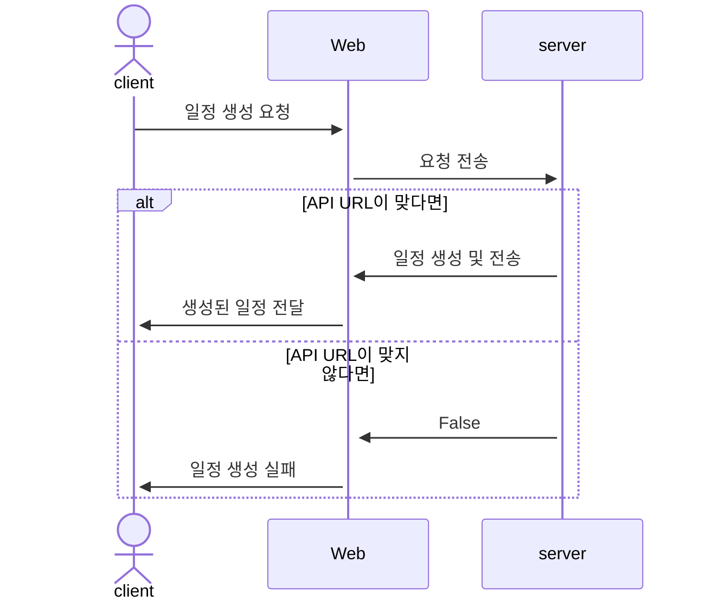
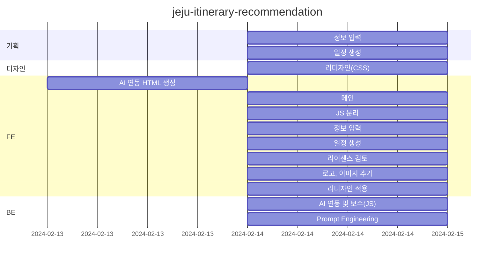
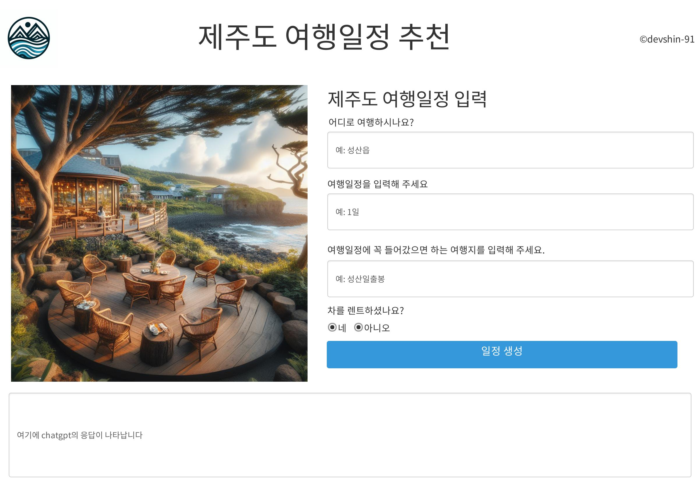
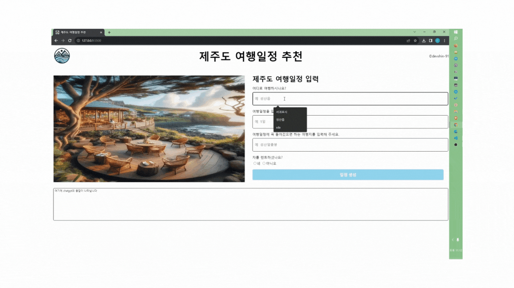
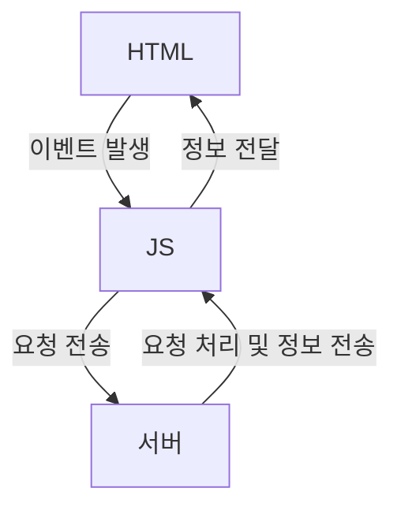

# jeju-itinerary-recommendation
제주도 여행일정 추천

## 1. 목표와 기능

### 1.1 목표
- 막연한 제주도 여행 계획에 도움을 줄 수 있는 웹 서비스

### 1.2 기능
- 최소한의 정보 입력으로 제주도 여행일정을 생성 
- 별도 로그인 없이 바로 서비스 이용 가능

### 1.3 팀 구성
<table>
    <tr>
        <th>신찬수</th>
    </tr>
        <td></td>
</table>


## 2. 개발 환경 및 배포 URL

### 2.1 개발 환경
- 사용 언어
    - HTML, CSS, JS
- 서비스 배포환경
    - github, 로컬 환경

### 2.2 배포 URL
- https://devshin-91.github.io/jeju-itinerary-recommendation/

## 3. 요구사항 명세와 기능 명세



## 4. 프로젝트 구조와 개발 일정
### 4.1 프로젝트 구조
```
📦jeju-itinerary-recommendation
 ┣ 📂css
 ┃ ┗ 📜style.css
 ┣ 📂images
 ┃ ┣ 📜cafe.jfif
 ┃ ┣ 📜logo.jfif
 ┃ ┗ 📜ms-icon-310x310.png
 ┣ 📂js
 ┃ ┗ 📜index.js
 ┣ 📜.env
 ┣ 📜.gitignore
 ┣ 📜index.html
 ┗ 📜README.md
```

### 4.2 개발 일정(WBS)
* 아래 일정표는 머메이드로 작성했습니다.


## 5. 역할 분담

- 팀장 : 신찬수
- FE : 신찬수
- BE : 신찬수
- 디자인 : 신찬수

## 6. 와이어프레임 / UI / BM

### 6.1 와이어프레임


### 6.2 화면 설계
<table>
    <tbody>
        <tr>
            <td>메인</td>
        </tr>
        <tr>
            <td>
		
            </td>
        </tr>
    </tbody>
</table>

## 7. Architecture



## 8. 개발하며 느낀점
- CSS를 다루면서 생각보다 시맨틱 태그를 쓰려고 하는 게 쉽지가 않았다.

- github 환경에서 민감한 데이터 노출과 같은 보안적인 문제를 생각할 수 있었다.

- github 환경에서 vanilla JS가 어떤 한계를 갖는지 확인할 수 있었고 추후 langchain이나 nodeJS로 보완해야겠다는 생각이 들었다.
