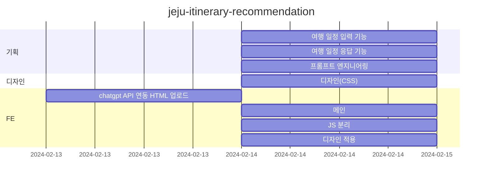

# jeju-itinerary-recommendation
chatgpt integrated jeju itinerary recommendation

# 1 개발 일정(WBS)
* 아래 일정표는 머메이드로 작성했습니다.

```mermaid
gantt
    title jeju-itinerary-recommendation
    dateFormat YY-MM-DD
    section 기획
        여행 일정 입력 기능 :2024-02-14, 1d
        여행 일정 응답 기능 :2024-02-14, 1d
        프롬프트 엔지니어링    :2024-02-14, 1d
    section 디자인
        디자인(CSS) :2024-02-14, 1d
    section FE
        chatgpt API 연동 HTML 업로드 :2024-02-13, 1d
        메인    :2024-02-14, 1d
        JS 분리    :2024-02-14, 1d
        디자인 적용 :2024-02-14, 1d
```